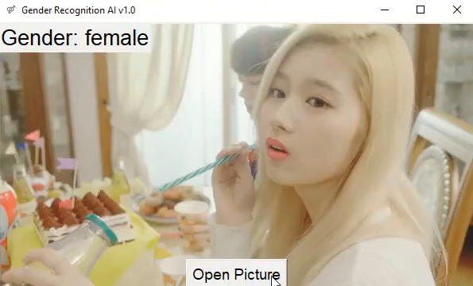

# Gender Recognition AI

[Watch the demo video!](https://www.youtube.com/watch?v=0mdLqAV7Dt8)

---

## Table of Contents

- [gender-recognition-ai](#gender-recognition-ai)
  - [Table of Contents](#table-of-contents)
  - [About the Project](#about-the-project)
  - [About the Author](#about-the-author)
  - [Prerequisites](#prerequisites)
  - [Built With](#built-with)
  - [Technologies Used](#technologies-used)
  - [Dataset Used](#dataset-used)
  - [Contributing](#contributing)
  - [License](#license)
  - [Questions](#questions)

## About the Project

Gender Recognition AI is the result of my experiments with Tensorflow and facial recognition libraries.
The model is able to distinguish males and females with relatively high accuracy, but currently no other
genders are supported.
 
 
 
[Link to video demonstration](https://youtu.be/0mdLqAV7Dt8)
 
## About the Author
**Anakin Trotter**
- [Link to Anakin's GitHub](https://github.com/AnakinTrotter)
- [Link to Anakin's LinkedIn](https://linkedin.com/in/anakintrotter)

## Prerequisites

Recommended Python 3.6+ then do pip install -r requirements.txt

## Built With
* [Python](https://www.python.org/downloads/)
* [TensorFlow](https://pypi.org/project/tensorflow/)
* [Face Recognition](https://pypi.org/project/face-recognition/)

## Technologies Used

* [PyCharm](https://www.jetbrains.com/pycharm/download/#section=windows)
* [GitHub](https://github.com/)
  
## Dataset Used
* [IMDB-WIKI – 500k+ face images with age and gender labels](https://data.vision.ee.ethz.ch/cvl/rrothe/imdb-wiki/)

## Contributing

Contributions are encouraged! Please create a pull request with your updated code.

## License

This project is covered under the MIT license.

## Questions

Please create an issue should you have any questions or feature suggestions.
